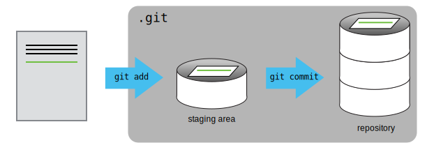

# Tracking, adding, committing, restoring changes

::: {.callout-note appearance="simple"}
# Key points 
- `git status` shows the status of a repository.  
- Files move through three states: the working directory, the staging area, and the local repository.  
- `git add` stages files; `git commit` permanently records them.  
- Write commit messages that accurately describe your changes.  
- `git diff` compares versions of files across the working directory, staging area, and commits.  
- `git restore --source <commit-id> <filename>` restores a file to a previous state without altering commit history.  
- `HEAD` refers to the most recent commit; `HEAD~1`, `HEAD~2` etc. refer to earlier commits.  
:::

First let’s make sure we’re still in the right directory. You should be in the recipes directory.  
```bash {title="Bash"}
cd ~/Desktop/recipes
```

Let’s create a file called `guacamole.qmd`{style="color:blue"} that contains the basic structure of our first recipe. We’ll use nano to edit the file; you can use whatever editor you like. In particular, this does not have to be the core.editor you set globally earlier. But remember, the steps to create or edit a new file will depend on the editor you choose (it might not be nano). For a refresher on text editors, check out [“Which Editor?”](https://swcarpentry.github.io/shell-novice/03-create.html#which-editor) in The Carpentries Unix Shell lesson.

```bash
nano guacamole.qmd
```

Put some text in your `guacamole.qmd`{style="color:blue"} file, for example:   
*(I am leaving instructions blank here to add in an example later of file modification)*

```
# Guacamole recipe

## Ingredients
- Avocado  
- Coriander  
- Red onion  
- Lemon juice  
- Salt  

## Instructions


```

Save your file and exit nano. 

Verify that the file was made, using `ls` and `cat` commands to explore the file. 

If we check the status of our project again, Git tells us that it’s noticed the new file:

```bash
git status
```

```
On branch main

No commits yet

Untracked files:
   (use "git add <file>..." to include in what will be committed)

	guacamole.qmd

nothing added to commit but untracked files present (use "git add" to track)
```

The “untracked files” message means that there’s a file in the directory that Git isn’t keeping track of. We can tell Git to track a file using `git add`:

```bash
git add guacamole.qmd
```

and then check that the right thing happened:

```bash
git status
```


```
On branch main

No commits yet

Changes to be committed:
  (use "git rm --cached <file>..." to unstage)

	new file:   guacamole.qmd
```

Git now knows that it’s supposed to keep track of guacamole.qmd, but it hasn’t recorded these changes as a commit yet. The file is in what is called the 'staging area'.

::: {.callout-note collapse="false"}
## What is the staging area?

Git has a special staging area where it keeps track of things that have been added to the current changeset but not yet committed. Git insists that we add files to the staging we want to commit before actually committing anything. This allows us to commit our changes in stages and capture changes in logical portions rather than only large batches. 

If you think of Git as taking snapshots of changes over the life of a project, `git add` specifies what will go in a snapshot (putting things in the staging area), and `git commit` then actually takes the snapshot, and makes a permanent record of it (as a commit). If you don’t have anything staged when you type `git commit`, Git will prompt you to use `git commit -a` or `git commit --all`, which is kind of like gathering everyone to take a group photo! However, it’s almost always better to explicitly add things to the staging area, because you might commit changes you forgot you made. (Going back to the group photo simile, you might get an extra with incomplete makeup walking on the stage for the picture because you used `-a`!) Try to stage things manually, or you might find yourself searching for “git undo commit” more than you would like!




:::


To get it to commit the staged files, we need to run one more command:

```bash
git commit -m "Create initial structure for a Guacamole recipe"
```
When we run `git commit`, Git takes everything we have told it to save by using `git add` and stores a copy permanently inside the special `.git` directory. This permanent copy is called a commit (or revision) and its short identifier is f22b25e. Your commit may have another identifier.

We use the `-m` flag (for “message”) to record a short, descriptive, and specific comment that will help us remember later on what we did and why. If we just run `git commit` without the `-m` option, Git will launch nano (or whatever other editor we configured as core.editor) so that we can write a longer message.

Good commit messages start with a brief (<50 characters) statement about the changes made in the commit. Generally, the message should complete the sentence “If applied, this commit will” . If you want to go into more detail, add a blank line between the summary line and your additional notes. Use this additional space to explain why you made changes and/or what their impact will be.

If we run `git status` now:

```bash
git status
```

```
On branch main
nothing to commit, working tree clean
```

it tells us everything is up to date. If we want to know what we’ve done recently, we can ask Git to show us the project’s history using `git log`, it will list all commits made to a repository in reverse chronological order. The listing for each commit includes the commit’s full identifier (which starts with the same characters as the short identifier printed by the git commit command earlier), the commit’s author, when it was created, and the log message Git was given when the commit was created.


Now suppose we add more information to the file. (Again, we’ll edit with `nano` and then `cat` the file to show its contents; you may use a different editor, and don’t need to `cat`)

```bash
nano guacamole.qmd
```

Add some text (here I have now added instructions):
```
# Guacamole recipe

## Ingredients
- Avocado  
- Coriander  
- Red onion  
- Lemon juice  
- Salt  

## Instructions
1. Mash the avocado
2. Finely chop the coriander and red onion
3. Add salt and lemon juice to taste  
4. Enjoy!  
```
Save your file and exit nano. 

When we run `git status` now, it tells us that a file it already knows about has been modified:

```bash
git status
```

```
On branch main
Changes not staged for commit:
  (use "git add <file>..." to update what will be committed)
  (use "git restore <file>..." to discard changes in working directory)

	modified:   guacamole.qmd

no changes added to commit (use "git add" and/or "git commit -a")
```

The last line is the key phrase: “no changes added to commit”. We have changed this file, but we haven’t told Git we will want to save those changes (which we do with `git add`) nor have we saved them (which we do with `git commit`). So let’s do that now. 

::: {.callout-tip collapse="true"}
### Other options for adding and removing files

We can also add multiple files at once to the staging area, by specifiying all the files in one command:

```bash
git add guacamole.qmd groceries.qmd
```

Or, by using `git add .` to add all files (new, modified, deleted files) in the **current directory and subdirectories** to the staging area:

```bash
git add .
```

Or, by using `git add -A` to add all files (new, modified, deleted files) in the **entire repository** to the staging area:

```bash
git add -A
```

If you need to delete a file that has already been added to the staging area, (which means git is now tracking it),  you need use `git rm` to remove the file (not just `rm`), so that git knows you want to delete it AND stop tracking it. 

```bash
# stops tracking and deletes the file
git rm file.qmd 
```

```bash
# stops tracking but keeps the file
git rm --cached file.qmd 
```

Don't forget to then `commit` your staged changes!

:::


### Review changes with `git diff`
It is good practice to always review our changes before saving them. We do this using `git diff`. This shows us the differences between the current state of the working file and the staged area:

```bash
git diff
```

```
diff --git a/guacamole.qmd b/guacamole.qmd
index ad0d963..6249f4c 100644
--- a/guacamole.qmd
+++ b/guacamole.qmd
@@ -8,3 +8,7 @@
 - Salt  
 
 ## Instructions
+1. Mash the avocado
+2. Finely chop the coriander and red onion
+3. Add salt and lemon juice to taste  
+4. Enjoy!
 ```


The output is cryptic because it is actually a series of commands for tools like editors and patch telling them how to reconstruct one file given the other. If we break it down into pieces:

1. The first line tells us that Git is producing output similar to the Unix diff command comparing the old and new versions of the file.
2. The second line tells exactly which versions of the file Git is comparing; ad0d963 and 6249f4c are unique computer-generated labels for those versions.
3. The third and fourth lines once again show the name of the file being changed.
4. The remaining lines are the most interesting, they show us the actual differences and the lines on which they occur. In particular, the + marker in the first column shows where we added a line.

```bash
git add guacamole.qmd
```

```bash
git diff
```


You'll notice that `git diff` produces no output. This is because **`git diff` only compares the working file to the staging area** — once a file is staged, there are no remaining differences between them.

To see the differences between what is staged and the last commit, we use the `--staged` flag:


```bash
git diff --staged
```

The output will now be the same as we saw earlier:


```bash
diff --git a/guacamole.qmd b/guacamole.qmd
index ad0d963..6249f4c 100644
--- a/guacamole.qmd
+++ b/guacamole.qmd
@@ -8,3 +8,7 @@
 - Salt  
 
 ## Instructions
+1. Mash the avocado
+2. Finely chop the coriander and red onion
+3. Add salt and lemon juice to taste  
+4. Enjoy!
 ```


### Final commit and review history

It's time to commit the modified version.

```bash
git commit -m "Add instructions for basic guacamole"
```

```
[main 8a8041c] Add instructions for basic guacamole
 1 file changed, 4 insertions(+)
 ```


Now let's check the project history and we can see that we have two commits, displayed in reverse chronological order (most recent commit first): 

```bash
git log
```

```
commit 1fc9cfd11bca89c9b43c7efbf1bb0534340f2eef (HEAD -> main)
Author: username <useremail@email.com>
Date:   Sat Apr 25 14:12:19 1953 +1200

    Add instructions for basic guacamole

commit 6d366b34965525200eeb4b2e8ec3252e4f875a34
Author: username <useremail@email.com>
Date:   Sat Apr 25 13:05:57 1953 +1200

    Create initial structure for a Guacamole recipe
```


We can use `git diff` with either HEAD~1 or the commit ID to see the differences between the current state of the working file and the referenced commit.

For example, let's use the first commit ID to see the differences between the current state of the working file and that commit (you will need to use yours!):


```bash
git diff 6d366b34965525200eeb4b2e8ec3252e4f875a34
``` 

or use the 7 first characters of the commit ID:

```bash
git diff 6d366b3
``` 

```
# Output - same as earlier
diff --git a/guacamole.qmd b/guacamole.qmd
index ad0d963..6249f4c 100644
--- a/guacamole.qmd
+++ b/guacamole.qmd
@@ -8,3 +8,7 @@
 - Salt  
 
 ## Instructions
+1. Mash the avocado
+2. Finely chop the coriander and red onion
+3. Add salt and lemon juice to taste  
+4. Enjoy!
```

Or we can use `HEAD`. `HEAD` is a special reference that always points to the most recent commit on the current branch. So, if we want to see the differences between the current state of the working file and the most recent commit, we can use:

```bash
git diff HEAD
``` 

Our most recent commit is the one we just made, and there are no differences between the current state of the working file and the last commit -- so no output!

Let's look at the differences between the current state of the working file and the previous commit (the one before the most recent commit). We can use `HEAD~1` to refer to the commit one before the most recent commit:

```bash
git diff HEAD~1
```

```
# Output - same as earlier
diff --git a/guacamole.qmd b/guacamole.qmd
index ad0d963..6249f4c 100644
--- a/guacamole.qmd
+++ b/guacamole.qmd
@@ -8,3 +8,7 @@
 - Salt  
 
 ## Instructions
+1. Mash the avocado
+2. Finely chop the coriander and red onion
+3. Add salt and lemon juice to taste  
+4. Enjoy!
```

You can use `HEAD~1`, `HEAD~2`, `HEAD~3` etc. to refer to earlier commits.

### Restore files to a previous state

One of the most powerful features of Git is the ability to restore files to a previous state. This is useful when you want to undo changes, or when you want to go back to a previous version of a file.

We use `git restore` to do this. To restore a file to the state it was in at a specific commit, we use the `--source` (or `-s`) flag followed by the commit ID (or a HEAD reference), and then the filename:

```bash
git restore --source <commit-id> <filename>
```

Let's restore `guacamole.qmd` to how it looked at our first commit — before we added the instructions. We can use the first 7 characters of the commit ID:

```bash
git restore --source 6d366b3 guacamole.qmd
```

Now open  or `cat` `guacamole.qmd` and you'll see the instructions section is gone — the file is back to just the ingredients list. Git hasn't deleted any history, it has simply replaced the working file with the older version.

```bash
cat guacamole.qmd
```

```
# Guacamole recipe

## Ingredients
- Avocado  
- Coriander  
- Red onion  
- Lemon juice  
- Salt  

## Instructions
```

We can confirm this with `git diff HEAD`:

```bash
git diff HEAD
```

```
diff --git a/guacamole.qmd b/guacamole.qmd
index 6249f4c..ad0d963 100644
--- a/guacamole.qmd
+++ b/guacamole.qmd
@@ -8,7 +8,3 @@
 - Salt  
 
 ## Instructions
-1. Mash the avocado
-2. Finely chop the coriander and red onion
-3. Add salt and lemon juice to taste  
-4. Enjoy!
```

The `-` markers show that the instructions lines are in the HEAD version of the file (a), but not in the working file (b). Importantly, while in this case it is true that the lines are removed from the working file, but it is more correct to say the markers designate which file version the lines belong to.

Now let's restore the file back to the most recent commit so we can continue working. We can use `HEAD` to refer to the most recent commit:

```bash
git restore --source HEAD guacamole.qmd
```

We can confirm there are no differences between the working file and the latest commit:

```bash
git diff HEAD
```

No output — our working file matches the latest commit and we're ready to continue. We can `cat` our guacamole.qmd to confirm our instructions are back:

```bash
cat guacamole.qmd
```

```
# Guacamole recipe

## Ingredients
- Avocado  
- Coriander  
- Red onion  
- Lemon juice  
- Salt  

## Instructions
1. Mash the avocado
2. Finely chop the coriander and red onion
3. Add salt and lemon juice to taste  
4. Enjoy! 
```


::: callout-note
`git restore` is safe to use because it only affects your working file. Your commit history is never altered. 
:::


### CHALLENGE ⚡️

**Recovering Older Versions of a File**

Jennifer has made changes to the Python script that she has been working on for weeks, and the modifications she made this morning “broke” the script and it no longer runs. She has spent ~ 1hr trying to fix it, with no luck…

Luckily, she has been keeping track of her project’s versions using Git! Which commands below will let her recover the last committed version of her Python script called data_cruncher.py?

1. `git restore`

2. `git restore data_cruncher.py`

3. `git restore -s HEAD~1 data_cruncher.py`

4. `git restore -s <unique ID of last commit> data_cruncher.py`

5. Both 2 and 4


::: {.callout-warning collapse="true" appearance="minimal"}
# SOLUTION

The answer is (5)-Both 2 and 4.

The `restore` command restores files from the repository, overwriting the files in your working directory. Answers 2 and 4 both restore the *latest* version *in the repository* of the file `data_cruncher.py`. Answer 2 uses `HEAD` to indicate the *latest*, whereas answer 4 uses the unique ID of the last commit, which is what `HEAD` means.

Answer 3 gets the version of `data_cruncher.py` from the commit *before* `HEAD`, which is NOT what we wanted.

Answer 1 results in an error. You need to specify a file to restore. If you want to restore all files you should use `git restore .`


:::


