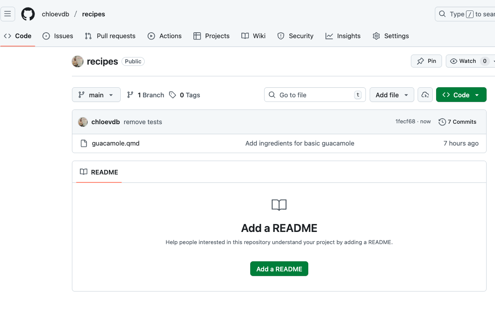
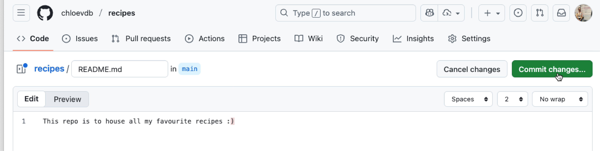
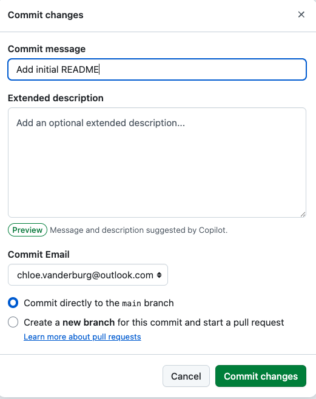
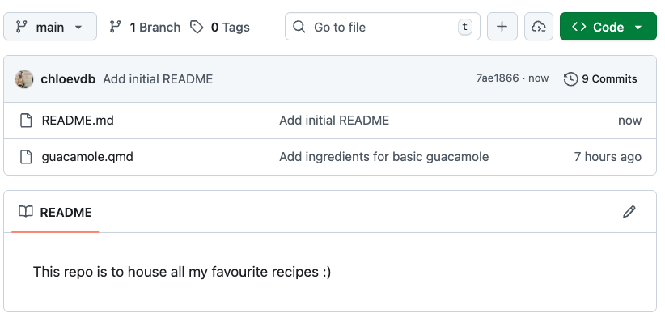
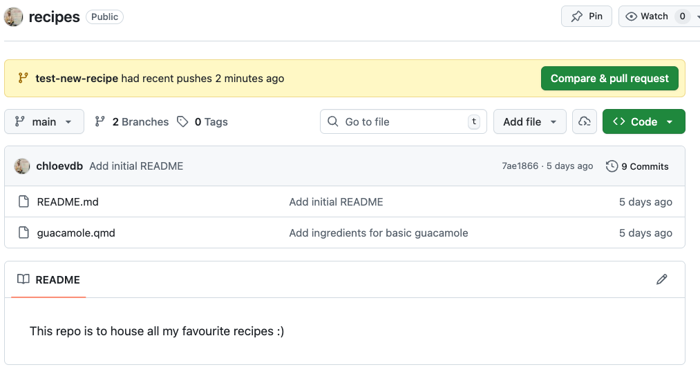
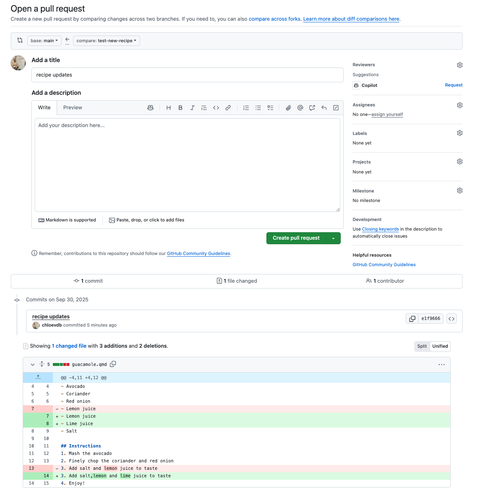
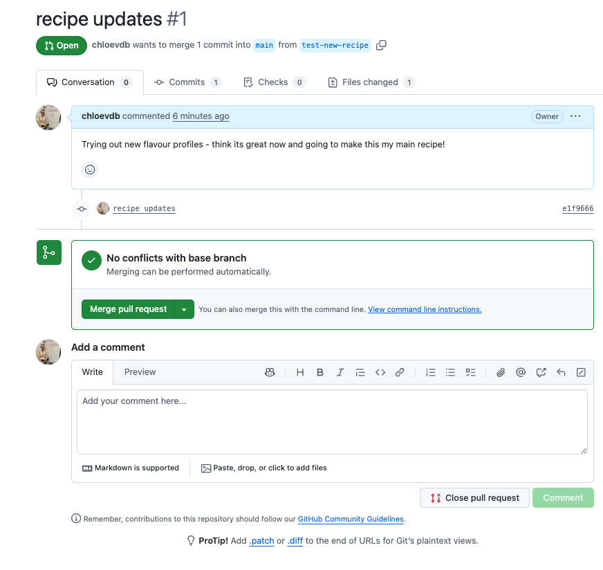
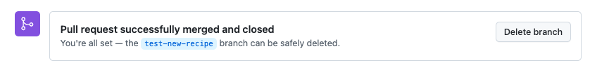
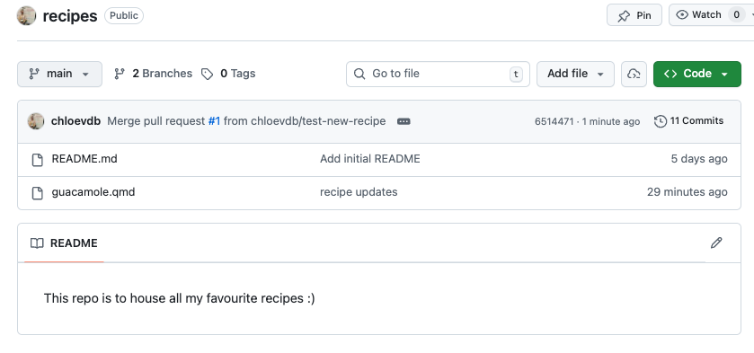

# Branches, pulling and merging

::: {.callout-note appearance="simple"}
# Key points
- `git pull origin main` will download changes on the server to your local directory 
- We can make new branches to work on major issues, then merge these into our main branch
:::


## Pulling repositories from the server to our local computer

Pulling takes changes made on a remote repository and brings them down into your local repository. For example, say you are collaborating on a project and your partner has made some changes and pushed them up to the github repo. You now want to pull down all those changes and keep working on the project locally.

Let's have a go at this.

### 1. Add a README file

Go to the recipes repository page on github. You will see an option to add a "README" file.



Click "Add a README" and add some info, e.g.:

```
This repo is to house all my favourite recipes :)
```

By adding this file directly on the GitHub server, we have simulated the same scenario as if someone had pushed this file to the repo instead.

::: {.callout-important collapse="true"}
# But what if I don't want people to be able to push to my repo?
By default, noone can push to a repo that you have made under your own GitHub account. But, anyone can [clone](https://docs.github.com/en/repositories/creating-and-managing-repositories/cloning-a-repository) or [fork](https://docs.github.com/en/pull-requests/collaborating-with-pull-requests/working-with-forks/about-forks) them. To restrict or modify acccess, under general settings you can add collaborators, or you can change the visibility of your repo from public to private.   
:::

Click commit changes:



Then you will be prompted to add a commit message. Add something sensible such as "Add initial README" and click commit changes.



You will then see your new file in your recipes repo with the new commit message:



### 2. Pull changes down

Back on your local command line, navigate to your recipes directory:

```bash
cd ~/Desktop/recipes
```

Now run the following to pull changes to your local computer:

```bash
git pull origin main
```
And you'll see an output like this:

```
From github.com:username/recipes
 * branch            main       -> FETCH_HEAD
Updating 1fecf68..7ae1866
Fast-forward
 README.md | 2 ++
 1 file changed, 2 insertions(+)
 create mode 100644 README.md
```

Run `ls` to see the files in your directory and confirm we now have the README file locally.

#### How does pull work? 

`git pull` does not blindly overwrite uncommitted local changes. When we pull everything from the server, the  most common scenario is the "fast-forward", such as we have done here. Git checks if you have changes that haven’t been committed yet. If you do, Git will try to merge the changes from the server with your local changes. If there’s a conflict (for example, if you and someone else changed the same line in a file), Git will stop and ask you to resolve the conflict before continuing. In the most common case (when you haven’t made any local changes or your local changes are already committed) Git can just add the new changes from the server on top of your work. This is called a “fast-forward” update, and it’s what happened in our example. Our local directory now matches the content in the Github server. There are different scenarios if your local file is behind and if there are merge conflicts. In this workshop, we will not cover how to deal with conflicts; you can [read more about it here](https://swcarpentry.github.io/git-novice/09-conflict.html) and more on recovering files and [exploring history here.](https://swcarpentry.github.io/git-novice/05-history.html)


## Branches

So far, we have been working on one branch, called main. We can add more branches to our tree, make any changes we wish safely without affecting the main branch and when we are ready we can 'Compare and pull' these changes into the main branch. Generally, we want to make branches to work on when we are doing bug fixes of our code or testing out major restructuring or styling and we don't want these to be pushed to the main branch just yet.

Let's practise making a new branch. 

Back in RStudio, type the following into terminal to see what branch you are currently on:

```bash
git branch
```

As we have been working on one branch, main, you should see this output:

```
* main
```

Now we can make a new branch and switch to it. You can name it anything you like, but its best to pick something that describes what you are doing with that branch. You may even want to name it after the 'Issue' you are addressing -- more on 'Issues' in the [next episode!](episode_07_Collaborate-Organise.qmd#issues)


```bash
git checkout -b test-new-recipe
```

```
Switched to a new branch 'test-new-recipe'
```

::: {.callout-tip collapse="true"}
## What does `git checkout` do?
If you run `git checkout branch-name`, it switches your working directory to the specified **existing branch.**  
If you run `git checkout -b branch-name`, it **creates and switches**  your working directory to the specified branch.  
If you run `git checkout file.txt`, it restores that file to its last committed state (discarding changes).  
If you run `git checkout` with no arguments, it will show you which files have been modified since the last commit.   

[More info here.](https://git-scm.com/docs/git-checkout)
:::

Now run `git branch` again:

```
  main
* test-new-recipe
```

And you can see we are now on a new branch, indicated with an asterisk. We haven't pushed our changes yet to the GitHub server, so you won't see the branch there yet.
Let's make some modifications, then push those up to the server.

Open your guacamole recipe with `nano` and make a new change to the recipe.

```bash
nano guacamole.qmd
```

I'm going to edit mine to add lime juice, you can do any change you like :)

```
# Guacamole recipe

## Ingredients
- Avocado  
- Coriander  
- Red onion  
- Lemon juice
- Lime juice  
- Salt  

## Instructions
1. Mash the avocado
2. Finely chop the coriander and red onion
3. Add salt,lemon and lime juice to taste  
4. Enjoy!
```

Now, add, commit and push your new changes:

```bash
git add guacamole.qmd
git status
```

```
On branch test-new-recipe
Changes to be committed:
  (use "git restore --staged <file>..." to unstage)
        modified:   guacamole.qmd
```

```bash
git commit -m "recipe updates"
git push origin test-new-recipe
```

```
Enumerating objects: 5, done.
Counting objects: 100% (5/5), done.
Delta compression using up to 8 threads
Compressing objects: 100% (3/3), done.
Writing objects: 100% (3/3), 338 bytes | 338.00 KiB/s, done.
Total 3 (delta 1), reused 0 (delta 0), pack-reused 0
remote: Resolving deltas: 100% (1/1), completed with 1 local object.
remote: 
remote: Create a pull request for 'test-new-recipe' on GitHub by visiting:
remote:      https://github.com/username/recipes/pull/new/test-new-recipe
remote: 
To github.com:username/recipes.git
 * [new branch]      test-new-recipe -> test-new-recipe
```


### Merging into our main branch

You may notice in the output it says:
```
remote: Create a pull request for 'test-new-recipe'
```
We can now review this pull request in github. You'll see a button "Compare & pull request"




This is GitHub asking if we want to 'pull' our new `test-new-recipe`{style="color:darkorange"} branch into our `main`{style="color:darkorange"} branch. Let's assume we are happy with our new recipe, and we want this to be on our main branch now. Click the "Compare & pull request" button. 




You can now see what changes were made in the file, and are given the option to 'Create pull request'. The title will default to the commit message you used and you can add further description if you like. Click 'Create pull request'. 

The pull request is now made, but our new branch has not been merged into main yet, it is waiting for us to merge it. There are different kinds of merges, but today we will do the default merge.



Optionally add a comment, or otherwise click 'Merge pull request'  to merge your `test-new-recipe`{style="color:darkorange"} branch into `main`{style="color:darkorange"}. GitHub will give you a default commit message, which you can leave as is. Click 'Confirm merge'.



It's good practice to 'trim your tree' and remove branches that you no longer need. You can click through to branches and safely delete the `test-new-recipe`{style="color:darkorange"} branch. 

Have a look back at your main repo now. You'll see the commit message has updated to the most recent one you used when you committed the changes to `guacamole.qmd`{style="color:blue"} on the new branch.




By default, other people cannot make branches directly on your repository, unless you have added them as collaborators. You can assign roles to collaborators to control if they are able to push directly onto main, or if you want to personally approve all pull requests. Other people **can** however fork your public repository (making a copy on their own account) and submit a pull request back to your original repository, which you can then decide to merge or not. You can switch your repository to private in settings -- note that you cannot turn private repositories into a website via GitHub pages.
 

## Merge conflicts

Merge conflicts happen when the remote repository has changes that have not been incorporated into the local repository. Git will reject the push/pull if it detects merge conflicts, and you may then need to tell Git how to resolve these. 

Let's create a merge conflict here and see how we can resolve it with git. 

After we merged our `test-new-recipe`{style="color:darkorange"} branch into `main`{style="color:darkorange"}, we now have a situation where the `main`{style="color:darkorange"} branch has changes that are not in our local repository. If we try to push or pull any changes we make to `guacamole.qmd`{style="color:blue"} now, we will get an error message about merge conflicts.

First, let's swap to `main`{style="color:darkorange"} branch and make a change to `guacamole.qmd`{style="color:blue"}:

```bash
git checkout main
``` 

```
Switched to branch 'main'
```      

Let's sanity check our local guacamole recipe file to see what it looks like locally:

```bash
cat guacamole.qmd
```

```
# Guacamole recipe

## Ingredients
- Avocado  
- Coriander  
- Red onion  
- Lemon juice  
- Salt  

## Instructions
1. Mash the avocado
2. Finely chop the coriander and red onion
3. Add salt and lemon juice to taste  
4. Enjoy! 
```

The lime juice we added in the `test-new-recipe`{style="color:darkorange"} branch is not in our local `main`{style="color:darkorange"} branch, even though it is in the `main`{style="color:darkorange"} branch on the server. This is because we haven't pulled the changes down to our local computer yet.

Before we pull the changes down, let's make a change to our local version to create a conflict. 

```bash
nano guacamole.qmd
```

Make a change to the file, e.g. add "Pepper" to the ingredients list, then save and exit. 

```
# Guacamole recipe

## Ingredients
- Avocado
- Coriander
- Red onion
- Lemon juice
- Salt
- Pepper

## Instructions
1. Mash the avocado
2. Finely chop the coriander and red onion
3. Add salt, pepper and lemon juice to taste
4. Enjoy!
```

Now we have ***pepper in our local version of the file***, but not in the version on the server. The version ***on the server has lime juice***, but NOT pepper. This is a **merge conflict.**


Let's try pushing this change to the server:

```bash
git add guacamole.qmd
git commit -m "add pepper to guacamole recipe"
git push origin main
```

```
To github.com:username/recipes.git
 ! [rejected]        main -> main (fetch first)
error: failed to push some refs to 'github.com:username/recipes.git'
hint: Updates were rejected because the remote contains work that you do not
hint: have locally. This is usually caused by another repository pushing to
hint: the same ref. If you want to integrate the remote changes, use
hint: 'git pull' before pushing again.
hint: See the 'Note about fast-forwards' in 'git push --help' for details.
```


Git is telling us that we cannot push our changes because there are changes on the server that we do not have locally. We need to pull the changes down first, but if we do this, we will get a merge conflict because of the pepper and lime juice issue.


```bash
git pull origin main 
```

```
remote: Enumerating objects: 1, done.
remote: Counting objects: 100% (1/1), done.
remote: Total 1 (delta 0), reused 0 (delta 0), pack-reused 0 (from 0)
Unpacking objects: 100% (1/1), 909 bytes | 303.00 KiB/s, done.
From github.com:username/recipes
 * branch            main       -> FETCH_HEAD
   cd23c85..830a54c  main       -> origin/main
hint: You have divergent branches and need to specify how to reconcile them.
hint: You can do so by running one of the following commands sometime before
hint: your next pull:
hint:
hint:   git config pull.rebase false  # merge
hint:   git config pull.rebase true   # rebase
hint:   git config pull.ff only       # fast-forward only
hint:
hint: You can replace "git config" with "git config --global" to set a default
hint: preference for all repositories. You can also pass --rebase, --no-rebase,
hint: or --ff-only on the command line to override the configured default per
hint: invocation.
fatal: Need to specify how to reconcile divergent branches.
```

Uh oh, another message!  git is telling us that we have divergent branches and we need to specify how to reconcile them. This is because of the merge conflict. We can choose to either **merge, rebase or fast-forward**.


This is now a good time to run `git status` and see what the merge conflict looks like!

```
On branch main
You have unmerged paths.
  (fix conflicts and run "git commit")
  (use "git merge --abort" to abort the merge)

Unmerged paths:
  (use "git add <file>..." to mark resolution)
	both modified:   guacamole.qmd

no changes added to commit (use "git add" and/or "git commit -a")
```

The most common option is to **merge**, which will create a new commit that combines the changes from both branches. This is the default option, so we can run:  

```bash
git config pull.rebase false
```

> Note: without the `--global` flag, this command only sets the merge option for this repository. If you want to set it as the default for all repositories, you can add the `--global` flag.

Now try git pulling again:

```bash 
git pull origin main
```

```
From github.com:username/recipes
 * branch            main       -> FETCH_HEAD
Auto-merging recipes/guacamole.qmd
CONFLICT (content): Merge conflict in recipes/guacamole.qmd
Automatic merge failed; fix conflicts and then commit the result.
```


```bash
cat guacamole.qmd 
```

```
# Guacamole recipe

## Ingredients
- Avocado  
- Coriander  
- Red onion  
- Lime juice  
- Lemon juice  
- Salt  
- Pepper

## Instructions
1. Mash the avocado
2. Finely chop the coriander and red onion
<<<<<<< HEAD
3. Add salt, pepper and lemon juice to taste  
=======
3. Add salt, lemon and lime juice to taste  
>>>>>>> 830a54cb09c5d8fb5e1820d8e5bd722524db3cb2
4. Enjoy!
```


The ✨`golden rule`{style="color:gold"}✨ is to *"make the file look how you want it to look".* 

Open the file in `nano` and edit it to look how you want it to look. You can keep both the pepper and lime juice, or you can choose one or the other, or you can change the recipe however you like.

```bash
nano guacamole.qmd
```

Save and exit nano, then:

```bash
git add guacamole.qmd
```

Check the status again:

```bash
git status
```

```
On branch main
All conflicts fixed but you are still merging.
  (use "git commit" to conclude merge)

Changes to be committed:
	modified:   guacamole.qmd
```

Commit the merge conflict resolution:

```bash
git commit -m "merge conflict resolve, keep pepper and lime"
```

Review your commit history to see the merge commit:

```bash
git log
```

Now finally we can push our changes to the server:

```bash
git push origin main
```