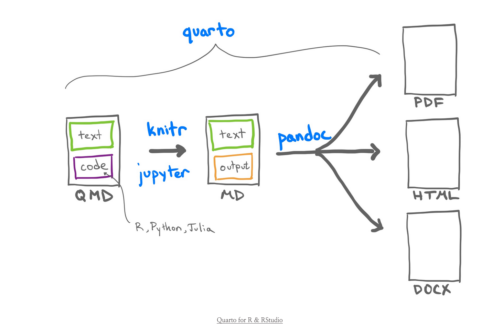

## What is Quarto?

Quarto is an open-source scientific and [literate programming system](https://en.wikipedia.org/wiki/Literate_programming) that facilitates the easy creation of documents that wrap and store our code, the outputs, and notes. With a small bit of extra effort when writing our code, Quarto can generate and easily switch between ouput formats, such as **pdfs, word docs, slideshow presentations, websites, books** -- even a PhD thesis! 

Quarto was first introduced in [July 2022](https://en.wikipedia.org/wiki/Quarto_(software)). It is designed for scientific publishing, and works with multiple languages (R, Julia, Python) - the outcome from these code blocks can be easily embedded (*e.g.,* if code produces a figure, that figure will appear in the document).

Quarto itself uses "markdown language", and will be familiar for anyone already using RMarkdown. Markdown is meant to be readable even before it's published, which means our day-to-day working documents are not a chore to work with.

Quarto places a premium on **quality** - the online community of people using quarto are creating stylistic, clear, well-designed documents that emphasise the importance of science communication. 

This website was built with Quarto. As an example, it has clear structure, embedded images and code, and a format that was very easy to create and replicate across documents. The same content could be easily redirected into a pdf or even a slideshow with very little effort. 

Another great example is the [R For Data Science (2e) book](https://r4ds.hadley.nz/) was created in Quarto -- both the printed version and the website. 

### What does this have to do with reproducibility? 

We propose using Quarto based on the assertion that that *code alone is not enough to ensure reproducibility*. A complete copy of all code, and an example dataset, can be used to accurately reproduce a result - however, it does not convey the logic, the reasoning, the *intent* of the work\. 

Quarto is a system for producing documents which contain all code, comments from the author, and embedded outputs. The system is easy to use and wraps around the code you will already be writing, with the aim of making this documentation part of your every day workflow. 

It captures:

- all code involved in viewing, manipulating, and storing data.

- a snapshot of the input format, so that we know what our data should look like going in.

- the outcome (tables, figures, saved files), so that we can independently re-run the analysis and ensure we get the same result, and demonstrate the format of the outcome so that we can use the method on our own data.

- the mindset and logic used at each step, so that we can understand why certain methods and thresholds were chosen and determine for ourselves whether to apply or modify those steps for our own analysis.

## How does it work? 

This visual comes directly from a [Quarto workshop presented at posit::conf(2023)](https://posit-conf-2023.github.io/quarto-r/) by Andrew Bray, Amelia McNamara, Emil Hvitfeldt, and Mouna Belaid. We highly recommend this workshop, which covers a lot of background detail and specifics that we won't have time to go over. 

In brief, we produce a `.qmd`{style="color:blue"} file (a Quarto file), which will include some mix of text, code, and the markdown language required to format and control the file. The code can be R, Python, Julia, *etc.,*. The code is converted into output (*e.g.,* figures are generated, sums calculated), and this is then converted into one or more output documents. 

::: {.callout-caution appearance="minimal"}
# ✨ Bonus for Rmarkdowns users

If you are familiar with RMarkdown this will all look and sound familiar, and these systems both aim to capture information and improve reproducibility. In fact, if you have RMarkdown documents you can rename them as `.qmd`{style="color:blue"} files and they will render using quarto.  

However, RMarkdown is R-specific. Quarto is language agnostic and can be used by people who work in Python, Julia and other languages.  
:::

